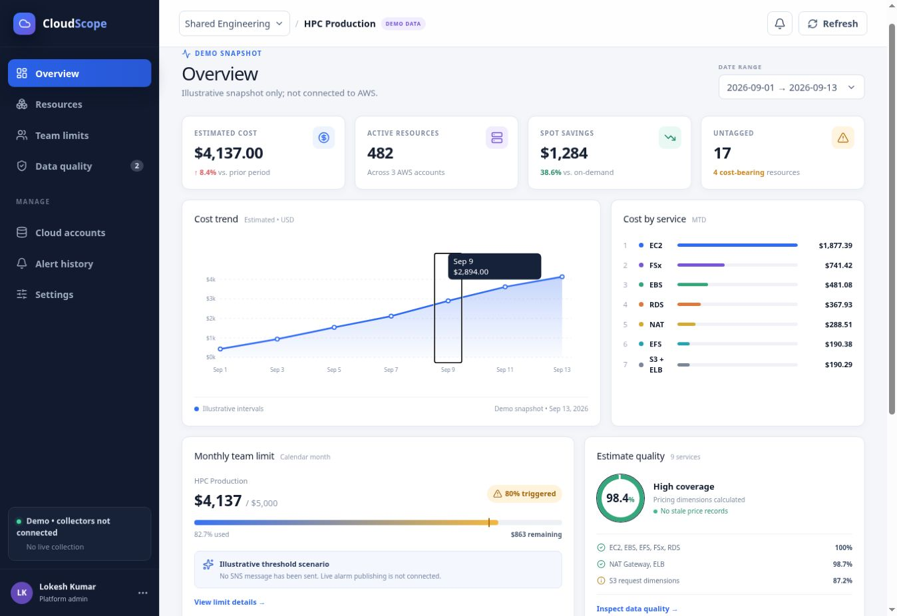
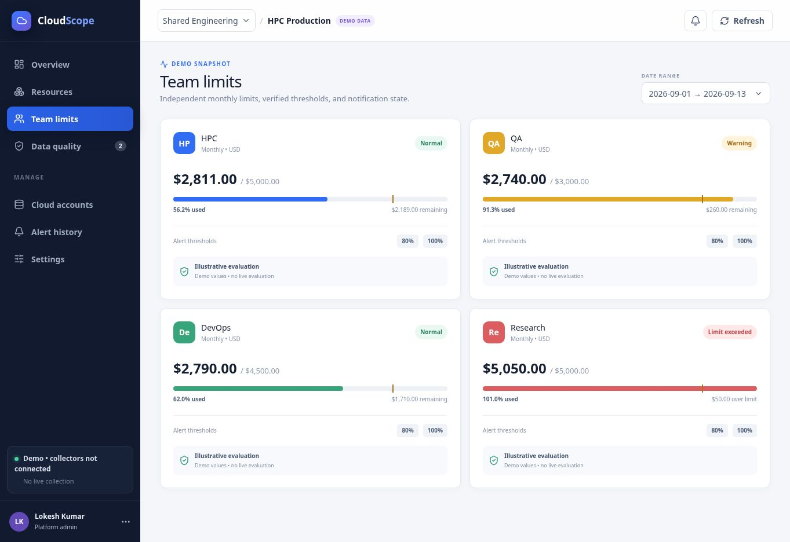

# CloudScope

Cloud resource consumption and team cost governance.

**Status: read-only pilot.** A local Compose deployment can show live stored
inventory and observed cost intervals from its Python API and PostgreSQL. The
separate hosted dashboard uses sample data. No SNS messages are published. Do
not use partial observed figures for chargeback, budget enforcement, or
production decisions.

## Sample dashboard and features

These screenshots show the running frontend with illustrative September 2026 data. Costs, coverage percentages and alert states are sample values. Overview and team cards demonstrate separate scenarios, not a reconciled ledger.

### Cost overview

Estimated spend, active resources, Spot savings, cost by service and monthly-limit progress. Select a chart point to inspect its date and amount.



### Team limits

Sample teams demonstrate normal usage, an 80% warning and a monthly-limit overrun. Cards show remaining budget or excess spend and 80%/100% thresholds. No SNS message or Lambda invocation occurred.



| Feature | Available in the prototype | Remaining integration |
| --- | --- | --- |
| Overview | Live observed KPIs, date range, service breakdown, trend and resource subtotals; separate sample view | Complete account cost aggregates |
| Resources | Search by name, ID or team; service and region filters; live stored inventory view | Complete cost dimensions for every collected service |
| Team limits | Sample states plus locally persisted pilot limits | Complete-cost evaluation and SNS delivery |
| Data quality | Sample coverage and freshness presentation | Measured pricing and collection health |
| Cloud accounts | CloudFormation generation, local registration, Roles Anywhere connection test and collection controls | Certificate lifecycle automation and production hardening |
| Alert history and notifications | Empty-state views | Durable alert history and SNS-to-Lambda integration |
| Settings | Device-local display preferences | Shared configuration persistence |
| Date selection | Ordered ranges up to 90 days; unavailable state outside the demo range | Historical data queries |
| Cost engine | Decimal interval calculations and fixture-tested EC2 pricing adapters | Verified live catalog and complete service billing dimensions |
| Collection scheduler | Opt-in durable jobs, account overlap lock, lease recovery and bounded retry | Concurrent worker-pool capacity testing for 100 accounts |
| Storage estimates | EBS provisioned dimensions; EFS and FSx storage-only partial estimates | Remaining filesystem usage dimensions and live catalog acceptance |

### Run the sample on a development VM

Use the Node and pnpm versions described in the [developer guide](docs/developer-guide.md#2-frontend). No AWS credentials are required.

```bash
git clone https://github.com/lokesh-veshala/cloudscope.git
cd cloudscope
pnpm install --frozen-lockfile
pnpm dev
```

For a container or trusted remote development VM, bind the development server explicitly:

```bash
CLOUDSCOPE_DEV_HOST=0.0.0.0 pnpm dev
```

Open the address printed by the server. For a remote VM, forward its development port over SSH instead of exposing the development server publicly. In the portable workflow the default port is 5173:

```bash
ssh -L 5173:127.0.0.1:5173 YOUR_USER@YOUR_VM
```

Then open `http://localhost:5173` on your computer. Explore **Overview**, select a chart point, search for `hpc` in **Resources**, and open **Team limits**. Only the default September 1–13, 2026 date range has a complete demo snapshot.

The [hosted sample](https://cloud-governance-control.karankiran422.chatgpt.site) is access-restricted; repository visitors can use these screenshots or run the frontend locally.

The complete Compose stack can collect inventory from one authorized test
account. The overview, cost, and limit views still show demo data; do not treat
their values as account spend. See the [release gates](docs/production-readiness.md).

## Documentation

| Document | Audience | Contents |
| --- | --- | --- |
| [Architecture](docs/architecture.md) | Engineers and reviewers | Current implementation, target boundaries, data model, cost calculations, failure modes |
| [Developer guide](docs/developer-guide.md) | Contributors | Setup, tests, API inspection, code layout, extension workflow |
| [Customer guide](docs/customer-guide.md) | Evaluators and account owners | Dashboard walkthrough, limitations, pilot prerequisites |
| [Production readiness](docs/production-readiness.md) | Maintainers and operators | Known defects, acceptance gates, deployment and incident requirements |

### Live AWS test stack

The Cloud Accounts screen can register a deployed CloudFormation stack, validate
the mounted IAM Roles Anywhere profile, and collect inventory into local
PostgreSQL. Account inventory and credentials are runtime data and are never
written to this repository.

Copy `.env.example` to `.env`, set absolute VM paths for the AWS config, signing
helper, collector certificate, and collector private key, then set the bind IP
and allowed browser origin. Start with `docker compose up -d --build`. Register
the stack outputs in Cloud Accounts, run **Test connection**, and only then run
**Collect now**.

This slice does not publish SNS alerts or display complete AWS spend. It stores
resource state/tag history, validates exact Linux/shared EC2 On-Demand rates,
and calculates conservative observed storage intervals. Supported EBS volume
dimensions are complete; EFS and FSx are explicitly storage-only and partial.
See [Storage cost models](docs/storage-cost-models.md) for the coverage matrix.
Before historical Spot coverage exists, Linux/shared Spot instances use a clearly
marked 42% discount assumption against the exact On-Demand rate. This fallback
is excluded from alarm evaluation. Other incomplete dimensions remain unresolved.

## What is implemented

- React/TypeScript dashboard with sample resource filters, date controls, chart tooltips, and management views.
- Live five-minute observed-cost trend with adjustable windows from one hour to
  seven days. Missing and unresolved buckets remain explicit gaps, not zeroes.
- Python interval calculator using Decimal arithmetic.
- Live account registration, Roles Anywhere connection checks, and V1 AWS inventory collectors.
- EC2 Linux/shared On-Demand catalog adapter and Spot history adapter, exercised with fixtures.
- Strict EBS, EFS and FSx storage catalog adapters with explicit partial/unresolved outcomes.
- In-memory threshold evaluator.
- PostgreSQL state/tag history persistence and a local four-service Compose stack.
- Live team creation with bounded AND/OR tag filters, server-side match previews,
  monthly limits, and exact resource drill-down. Historical observed costs use
  the tags stored on each interval rather than the resource's current tags.
- Team deletion and per-resource observed interval history with clipped UTC
  duration, pricing basis, calculation reason, unresolved count and subtotal.
- Team consumption charts follow the selected UTC range, using hourly buckets
  for up to two days and daily buckets otherwise. Unresolved periods are marked
  separately and are never rendered as zero cost.
- Audited manual SNS test delivery to the account's approved topic. SNS can
  invoke a subscribed customer Lambda; automatic threshold delivery remains
  disabled until complete-cost eligibility is satisfied.

The target system still requires complete multi-service usage ingestion,
historical pricing persistence, server-side authorization, retention cleanup,
production-scale scheduling and SNS delivery.

## Quick verification

From the repository root, using Python 3.13:

```bash
PYTHONDONTWRITEBYTECODE=1 PYTHONPATH=backend python3 -m unittest discover -s backend/tests -v
```

The current suite contains 75 tests. No AWS account is required. Source-level UI
checks are not browser tests.

See the [developer guide](docs/developer-guide.md) for frontend and API setup.
The Compose stack is for a controlled test network; the API does not yet provide
user authentication and must not be exposed to the public internet.

## Repository provenance

The frontend was scaffolded with a Sites/Vinext starter. The current UI is React on Vinext/Vite, not a standalone React SPA, and the hosted frontend is separate from the Python container. Existing `.openai/hosting.json` belongs to the original hosted project; contributors must not reuse that identity to publish a different project.

No current AWS price list is bundled or verified. Numbers in fixtures are test inputs, not price quotations.
